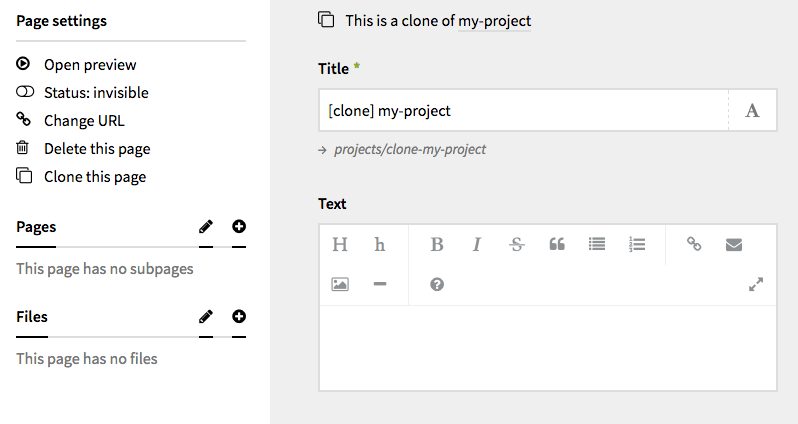

# Clone-page field

A custom [Kirby](http://getkirby.com) field which adds a "clone page" button in the sidebar of the panel page.



## Kirby installation
Put the content of this repo in `/site/fields/clone/`.

<sup>_Please note that in order to put a custom action item in the panel's sidebar, I had to use a hacky injection method. Due to that, this field may not work on panel versions other than `2.3.2`._</sup>


## Options
```YAML
fields:
  clone:
    type: clone
    text: 'Clone this page'
    prefix: '[clone] '
    sourceable: true # show a link to the clone source
```

## Credits
This repo is heavily based on [Sonja Broda](https://github.com/texnixe)'s [`kirby-clone-field`](https://github.com/texnixe/kirby-clone-field).

I chose to create a new repo rather than fork its own because I wanted a different approach to experience of cloning a page.

## Contribute
Feel free to fork and pull request. Also, go check out the original [`kirby-clone-field`](https://github.com/texnixe/kirby-clone-field).

## License
[MIT](https://tldrlegal.com/license/mit-license).